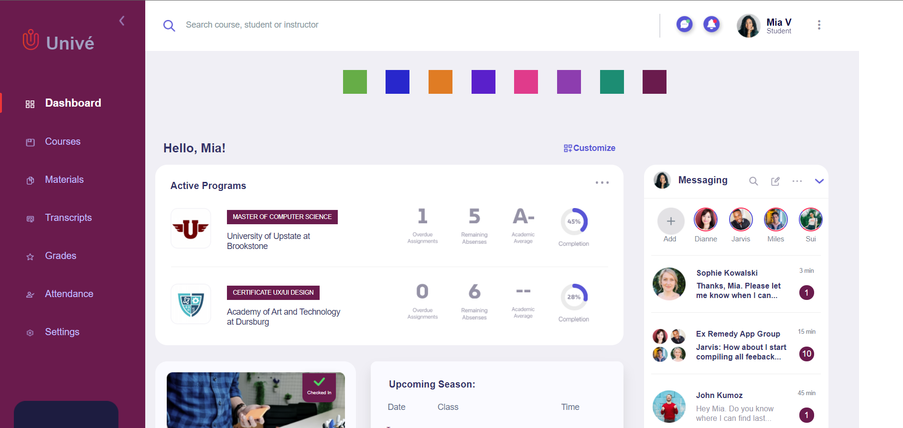

# Student Dashboard Figma 

&nbsp;
&nbsp;
&nbsp;
&nbsp;
&nbsp;

# Design Structure
<ul>
  <li>Atomic Design Principle</li>
  <li> BEM Methodology</li>
</ul>

[Unive Student Figma Design  link](https://www.figma.com/file/3o1SF06Sz3pCaB2GXCTsxV/Student-Dashboard)

